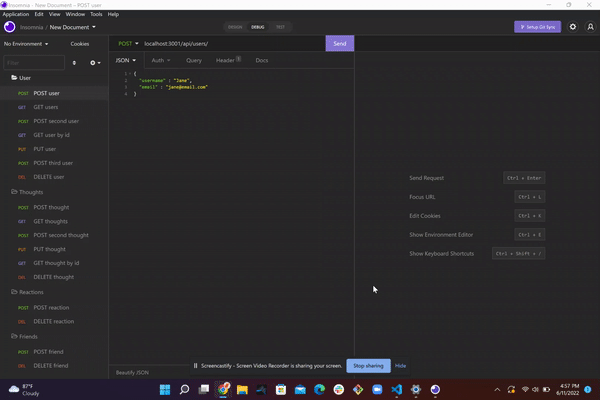

# Thought Keeper 

  # About
  Thought keeper is an API for a social network. You can use the included controllers to create an account, add/remove friends, and post thoughts, which other users will be able to react to with their own comments. It includes email validation and requires unique entries for emails to ensure duplicate accounts aren't made with the same email. It also includes virtuals that will keep a running count for how many reactions a thought has received. 
  
  ## Table of Contents
  - [Intallation](#installation)
  - [Usage](#usage)
  - [Credit](#credit)
  - [License](#license)
  - [Contribute](#contribute)
  - [Tests](#test)
  - [Questions](#test)

  # Installation
  Clone the repo. Point your command line to the repo, and run npm i to install the required modules for Thought Keeper to run. After the modules have been installed, refer to the controllers and routes to set up your API client to recieve and manipulate the data (Thought Keeper was ran and tested using Insomnia, other platforms untested). 

  # Usage

  A video walkthrough of Thought Keeper can be found [here.](https://drive.google.com/file/d/1c7XB0aezkB8-RoAyW78cTou-HowU-kOV/view?usp=sharing)

  After the API has been set up, open your API client. Refer to the routes inside the 'routes' folder to see how the routes are set up to use the controllers. The included 'models' folder will also show you how to set up each entry when you are sending a POST/PUT. For example, the User model requires a username and email. There are built-in validators to check the email, and an error will occur if an invalid email format is submitted. It will also check for duplicates in the database and reject any repeating information. 

  Thoughts are like posts on any other social media platform. They must refer to a user, and will be tied to their ID's. This is done in the POST method, where a user ID will be required in the URL used to submit the POST request. Thoughts may also be edited using a PUT request, where the URL will include the user ID as well as the thought ID (for example, localhost:3001/api/thoughts/>userID/>thoughtID). A similar URL with a DELETE request will remove the thought from the user's profile, and can no longer be seen or interacted with. 

  A reaction is a reply to another user's thought. Both thoughts and reactions are limited to a 280 character limit, though this limit can be changed by modifying the Thought schema in the models folder. A reaction may also be deleted with a DELETE request as designated in the thought-routes file (for example, localhost:3001/api/>userId/>thoughtId/>reactionId). 

  Users can add or remove other users as friends in Thought Keeper. This can be done with a POST or DELETE request pointed at a URL containing both users' IDs (for example, localhost:3001/api/>userId/friends/>friendId). This will include a record of which users are friends when you send a GET request to users stored in the database.

  

  # Credit
  Created by Austin Carter. 

  # License
  This project is covered under the gpl3.0 license. For more information, visit this [resource](https://choosealicense.com/licenses/) on project licenses.

  # Questions
  If you have any questions, you can find me on [github](https://github.com/auscarter17).
  

